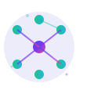

# Open Agents: The Ultimate Multi-Agents Framework


<!-- [](https://discord.gg/5rJgQTnV4s) -->
<!-- [](https://github.com/sponsors/tjbck) -->

**OpenAgents is an extensible framework designed to facilitate the creation, coordination and deployment of such systems.**

<p align="center">
<a href=""></a>
</p>
<p align="center">
<a href="https://opensource.org/licenses/MIT"></a>
<a href="https://discord.gg/xUbfcfeT"></a>
<!-- <a href="https://twitter.com/MetaGPT_"></a>
</p> -->

## News

## Get started
### Project information
- Supported OS: `MacOS`, `Windows`
- Tech stack: `python`, `fastapi`, `langchain`, `langgraph`, `langsmith`, `huggingface`, `gemini`, `llama`, `bitnet`, `docker`
### Features
- 🪄 Build your own AI agent or group of agents.
- 💬 Chat with your agents. 
- 🖥️ Montoring AI agents workflow.
- 🔨 Integrates with Open WebUI to run the platform locally.
### Installation
Via pip: 
```bash
pip install open-agents
```

For development
- Clone the repository:
    ```bash
    git clone https://github.com/duongnguyen-dev/open-agents.git
    ```
- Install required dependencies:
    ```bash
    conda create -n openagents python==3.11 && conda activate openagents
    pip install -e .
    ```
- Run frontend:
    ```bash
    cd frontend && npm install
    npm run dev
    ```
- Run backend: 
    ```bash
    cd open-agents
    python main.py
    ```